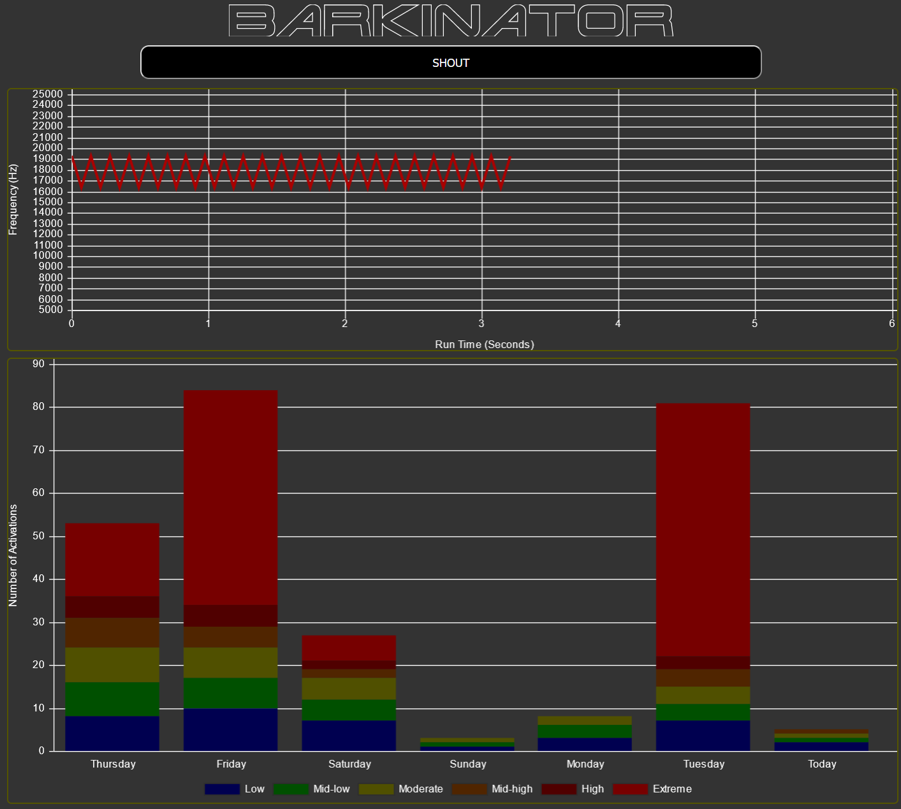

# Powerful Bark Deterrent Device

## Table of Contents

1. [What is this?](#what-is-this?)
2. [Quick Start](#quick-start-(simplest))
3. [Radio Setup](#radio-setup)
3. [Rationale](#rationale)
4. [Issues](#issues)

## What is this?

This document contains instruction on how to set up a bark deterrent device. It is my hope that anyone, with a little bit of ancillary research, should be able to get this thing up and running. Yes, this is a pretty granular step-by-step guide but my target audience is at the rookie level. Features of the software include,

- Implementation on a [Raspberry Pi Zero W](https://www.raspberrypi.com/products/raspberry-pi-zero-w/)
- Outputs a signal compatible with widely available aftermarket vehicle audio amplifiers
- Remote operation via LAN browser interface, or pin input on the Raspberry Pi
- Variable randomized sound generation, with the length depending on recent activity
- One week activation history visualization
- Sound wave generation visualization
- Build file included for simplified setup

## Quick Start

**WARNING: Depending on the hardware you choose to use, the sounds generated by this device will easily be capable of damaging yours (or someone elses) hearing. The extra sound capacity should ONLY be used to permit sound transmission over distance, not to hurt anyone or anything. Be careful when working near the device. If you're reading this then you are probably already frustrated, but don't punish an animal because it has a crappy owner. Use this device at your own risk. I take no responsibility for the misuse of this document.**

The most simple setup will use a Raspberry Pi acting as a server, which will be controlled over a web interface. These instructions will assume that you will be using a Raspberry Pi Zero W, with a car sound amplifier.

### Hardware Setup

#### Parts Needed

- [Raspberry Pi Zero W](https://www.raspberrypi..com/products/raspberry-pi-zero-w/)
    - Any should work, but I used the Raspberry Pi Zero W
    - Keep in mind that some of the older Pi models have a different pinout
- SD Card (A small capacity should be fine)
- Amplifier (I used an ancient [Kenwood Excelon](https://www.manualslib.com/manual/286662/Kenwood-Kac-X201t.html), but only because it is what I had on hand)
    - Most car amps will accepts the raw 3.3v output from the Pi pins, check your manual
- [Tweeter Speaker](https://www.amazon.com/gp/product/B00079P752) (Mine is capable of 25kHz output)
    - Any should work, though you should consider the frequency ranges
    - The default frequency range of the software tops out at 25kHz
    - The speaker will be playing a square sound wave, which is rough on the voice coil of the speaker. I would recommend getting a higher power speaker than you think that you will need to provide a little headroom for this abuse
- [Power Supply](https://www.amazon.com/gp/product/B07VTLJS18) (Needs to be sized to your amplifier power)
    - My main system uses a 12v 29a [supply](https://amazon.com/gp/product/B07VTLJS18) that was previously used on a 3D printer
    - I used a [buck converter](https://www.amazon.com/gp/product/B079N9BFZC) to provide the 5v to power the Raspberry Pi, otherwise you will need a separate 5v power source also for the Pi itself
- Custom adapter wire (Dupont female to RCA male)
    - will need to connect Positive/Negative female [Dupont](https://www.amazon.com/Elegoo-EL-CP-004-Multicolored-Breadboard-arduino/dp/B01EV70C78) plugs to the Pi GPIO to the [RCA](https://www.amazon.com/C2G-40463-Value-Stereo-Meters/dp/B0019MEG4E) input that is present on most car amplifiers

The unit that I built is an all-in-one unit in a weather resistant enclosure powered with a 110v extension cord. However, it would be preferable to have the electronics located in a climate controlled environment with only the speaker exposed to the elements. Alas, this was not possible for me due to the long speaker wire that I would need.

You should be familiar with the Raspberry Pi [pinout](./images/pinout.png). We will be using the software pin numbering in this guide, shown in the rectangles along the sides of the image, **NOT** the pin numbers listed in the circles. This is a fairly simple hardware setup, and due to the variability of components, I didn't make a diagram. These are the steps that will complete the setup,

1. Create an adapter wire for the signal connection between the Raspberry pi and the amplifier. It needs to have an RCA connector on one end, and two Dupont connectors on the other. The center part of the RCA connector is the positive polarity, though I'm certain that it doesn't matter. My fabricated wire can be seen [here](./images/circuitry_setup.jpg), I included a small section of speaker wire to increase the length because I was using materials that I had on hand and it was shorter than I needed. Except for the Pi, everything else in the image is optional and unnecessary for this part of the guide.
2. Connect the positive Dupont plug into GPIO12 and the negative plug to one of the ground pins. The RCA part of the wire should be connected to one of the inputs of the amplifier (if using a car amplifier, usually the left channel is set up for mono sound, check your manual)

    **Note:** It is important that this pin 12 be used as opposed to any of the other GPIO pins. GPIO12 connects to one of the hardware PWM channels on the Pi. If connected to one of the other GPIO pins, the PWM signal will be emulated in software, which the Pi CPU is incapable of computing at the frequencies that we need.
3. Connect your 12v power to the amplifier. If you are using a car amplifier, most will have an extra terminal that allows it to be switched on and off along with the car (Mine is labeled "P.Conn," check your manual). You will either need to add 12v to this terminal from your power source, or just use a jumper wire from the amp power connector.
4. Connect your speaker to the amplifier audio output (If using a car amp, most will have a special hookup configuration that is intended for mono sound, use it if yours has it, check your manual)
5. Take a moment to thumb through your amplifier manual to make sure that any form of high frequency audio filtering is turned **off**. I would also adjust any audio gain settings to their lowest values and adjust up from there. I have been adjusting mine weekly to try to get it dialed in without blowing my speaker. You want it to have just enough volume to be effective.
6. Provide your Raspberry Pi 5v power, and you should be ready to go!

### software Setup

- Computer Setup
    1. Download and install the [Bitvise](https://www.bitvise.com/ssh-client-download) client in order to SSH to your Raspberry Pi (These instructions will use version 8.44).

- SD Card Setup
    1. Put the SD card into your computer 
    2. The Raspberry Pi foundation recently released a downloadable [program](https://www.raspberrypi.com/software/) that can be used to configure and install the Raspberry Pi OS image. Download and install it (v1.7.3 at the time of this writing).
    3. Click "Choose OS" -> "Raspberry Pi OS (other)" -> "Raspberry Pi OS Lite (32-bit)" (v.9-22-22 used in my install).
    4. Click "Choose Storage" and select the drive that contains your SD Card.
    5. Click the gear icon in the bottom right corner of the window
        1. Make sure that "Enable SSH" has a checkmark
        2. Make sure that "Set username and password" has a checkmark, and that you have entered one
        3. Make sure that "Configure wireless LAN" has a checkmark, and that you have entered your network SSID and password into the fields
        4. Click "Save" to return to the main window
    6. Click "Write" to burn the OS image to the SD card
    7. Transfer the SD card to your Raspberry Pi and power it up (It will probably take a few minutes to boot up the first time, be patient)

- Server Setup

    These instructions will take you through a headless (without a monitor) setup of the server.
    1. Log into your router (i.e. 192.168.1.254), the login credentials are usually physically printed on the router itself
    2. Find the local IP address of your Raspberry Pi. Every router is different, sorry I can't help much here. However, the default device name will be raspberrypi unless you changed it to something different in the SD card setup
    3. Open the Bitvise program on your computer and in the "Login" tab:
        - Enter your IP address into the Server->Host field
        - Enter your login credentials into the fields in the Authentication section
        - Click "Log in"
        - If the login is successful, both an SSH terminal interface and a SFTP window should pop up
    4. Copy the following command into the SSH terminal. It will take quite a bit of time to complete all of the operations, mine took just under 21 minutes to finish. Grab a coffee or tea or something, 
        
        `sudo apt update && sudo apt upgrade -y && sudo apt install git -y && cd / && sudo git clone https://github.com/CoolerGalaxy/Barkinator && sudo bash /Barkinator/setup.sh && sudo reboot`

        **Note:** A right click in the SSH terminal will paste the code.

        This command will install all software dependencies and configure your Raspberry Pi to start the services used for the Barkinator on every reboot of the Pi. It will also reboot the Pi, after which it should be ready to use.
- Software Use

    This is a simple program to use. Open your web browser and navigate to your local Raspberry Pi LAN address, by default it will set up on port 7070 (i.e.enter 192.168.1.231:7070 into your browser address bar). I'd recommend making a bookmark to get to it more quickly in the future. Pressing the "SHOUT" button will instruct the Pi to generate a PWM signal which is modulated across a randomized range of ultrasonic frequencies. After your first shout, the on-page graphics should populate. The top graph represents the waveform of the last outputted sound and the bottom graph is a one week history of activations. The software uses an excitation level that will cause the length of the outputted sound to increase with each subsequent activation. The excitation level will increase with an extra activation before 60 seconds have elapsed, and if 5 minutes pass then the excitation level will reset to zero. These excitation levels are color coded in a stacked bar chart to show the degree that the animal is responding to the device over time.

    You should think of this device as something that is used to train the animal (which will eventually work), not punish it (which will likely not work, depending on the temperament of the animal). It is not recommended to spam the device activations. The activations are queued at the OS level, so if 10 shouts are pressed in quick succession then, while the waveform will be different for each, the outputted sound will be <1+1+2+3+4+5+5+5+5+5 seconds long.

    The webpage is designed to be able to be displayed on a desktop or mobile device. However, it uses the detected resolution to switch between the two modes and it is configured for my personal devices (all of which use a very high resolution). You may need to adjust the zoom level to have it display properly on your device.

    Here is a screenshot of the software,

    

## Radio Setup

The server software is also designed to work via activation of pin 16 on the Raspberry Pi. I used this functionality to install a [radio transmitter](https://amazon.com/gp/product/B07C9F4VJX) so that it can be activated even outside of WiFi range. However, while the transmitter has a respectible range, electronic interference from the high power amplifier and power supply limited the range more than I had expected. Keep this in mind if you decide to take advantage of it. The client will poll the server every 5 seconds for an update, so there may be a slight delay between radio activation and when the graphics update.

If you get this exact transmitter, know that you will need to desolder an extremely tiny micro-resistor. Unfortnately, my soldeing skills were not up to the task to resolder it into a different position and I burned off one of the contact pads on the circuit board. I corrected the problem in software to make it still work, so the pin activation works with a on/off toggle instead of a momentary activation. If you get this exact transmitter, just remove the resistor and you should be golden.

I made a voltage splitter circuit to provide the signal voltage for pin activation since the transmitter needed a higher voltage than the Raspberry Pi pin could provide. Don't be an idiot like me, if you use this feature just use a mosfet on the Pi 3.3v pin.

## Issues

This project was one of necessity for me, but seems to be effective so far. I rationalized the development investment by trying to use it as a learning experience to use technologies/tools that I hadn't used before. I am aware that the code base is garbage and that there are quite a few problems with this software. I am way over the time that I had budgeted to work on this device, and I don't intend to support or maintain it any further. That being said, I'd be happy to entertain any pull requests for anyone who wants to improve it. Below is list of known issues,
- short polling is a terrible choice for the client/server communication in this application (it was one communication method that I hadn't used before)
- The client should have a more robust method of detecting a mobile device vs desktop browser (This one was due to laziness)
- It would be preferable to generate a pure sine wave rather than a modulated square wave (I was trying to keep the costs down and the barrier to entry low, but it would be easier on the speaker)
- The code base has little modularity
- These instructions are written for software that I happened to already have installed on one of my old devices (as such, some are older versions)
- This software is completely untested on anything except for the Raspberry Pi Zero W, other processors might generate undesirable waveforms
- The log file generated by this software is ugly (trying to keep the data footprint small)
- The first uses of the software are wonky, ideally it should show a blank graph until it is populated. But as it is, the graph errors out when it has no data

## Rationale and Working Setup

I started working from home a couple of years ago, which happened to coincide with my neighbors adopting two very loud aggressive doberman dogs. They have barked almost nonstop during the day, frequently at night, and many times early in the morning disturbing my sleep. My neighbors are not bothered by this behavior, or concerned about my peace mind. I'm in a graduate Computer Science program, and writing code with the constant barking wasn't working for me and felt like a form of torture, so I developed this device to try to correct the problem.

I tried off the shelf solutions, a journey that ended with the purchase of a $150.00 [Dog Silencer MAX](https://www.amazon.com/Good-Life-Silencer-Automatic-Detection/dp/B0B94KNBK8), which did not work and that I ended up not being able to return. My idea for this project was to create a widely accessible setup for people who are in the same situation as me. I'm a computer/electronics geek, and as such had most of the needed materials at hand, I only had to purchase the (optional) $10 radio transmitter/receiver and a piezo speaker capable of generating ultrasonic frequencies. I expect that with a little scavenging the device could be built for pretty cheap, definitely less than the Dog Silencer MAX.

For anyone interested in [my setup](./images/setup.jpg), mine is extremely frugal. To create the enclosure I used a bunch of scrap plywood that came from the floor off of an old bus that I'm convering to a camper. It is designed in a way that water will not passively drain inside the enclosure, since it is directly exposed to the elements, but the entire box flips up on a hinge for easy access. I used an metal [5 gallon adhesive bucket](./images/bucket.jpg) as a base and tossed a half-bag of paver gravel for dead weight. The speaker has a little hat made of 3" PVC pipe with a 3D printed flange. Finally I [painted](./images/outside.jpg) the whole thing to somewhat match the brick on my house to keep the wife happy.